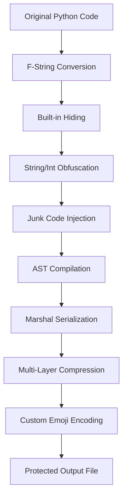

# 🐉 Shenron Python Obfuscator

<div align="center">


**A powerful Dragon Ball-themed Python code obfuscator**

[](https://python.org)
[](LICENSE)
[](https://t.me/CalceIsMe)

*Transform your Python code with the power of the Eternal Dragon!*

</div>

## 🌟 Features

- **🔐 Advanced Code Obfuscation**: Multi-layer protection using custom encoding with Dragon Ball emojis
- **🛡️ Anti-Debugging Protection**: Built-in checks against code modification and hook detection
- **🗜️ Multi-Compression**: Uses Base64, BZ2, ZLIB, and LZMA compression layers
- **🎭 Built-in Hiding**: Option to hide Python built-in functions
- **🗑️ Junk Code Injection**: Adds meaningless code to confuse reverse engineers
- **✨ F-String Conversion**: Automatically converts f-strings to join operations
- **🎨 Beautiful CLI**: Colorful command-line interface with Dragon Ball theme
- ** VM UPDATE INCOMING !!!!
## 🚀 Installation

### Prerequisites
- Python 3.6 or higher
- `pystyle` module (auto-installed if missing)

### Quick Install
```bash
git clone https://github.com/nguyenxuantrinhnotpd/Shenron.git
cd Shenron
pip install -r requirements.txt
python shenron.py
```

## 📖 Usage

1. **Run the obfuscator**:
   ```bash
   python shenron.py
   ```
TIP: Make sure the script is in your folder or drag the file and drop it in your terminal
2. **Enter your file name** when prompted :
   ```
   >> Enter Your File Name: your_script.py
   ```

3. **Choose obfuscation options**:
   - Hide builtins (Y/n): Recommended for better protection
   - Use VM (Y/n): For irreversible code
   - Add junk code (Y/n): Recommended for advanced obfuscation

4. **Get your obfuscated file**:
   ```
   >> Saved in obf-your_script.py
   >> Done in 2.345s
   ```

## 🎯 How It Works

### 1. **Dragon Ball Encoding**
Shenron uses a custom character mapping system that replaces standard Base64 characters with Dragon Ball-themed emojis:

```python3
string = 'ABCDEFGHIJKLMNOPQRSTUVWXYZabcdefghijklmnopqrstuvwxyz0123456789+/'
custom = '🐉🐲⭐✦✧✨💫🌠⚡🔥💥☄️🌪❄️🌀🥋🥊⚔️👊🙌👐🟠🔴🟡🟢🔵🟣⚫⚪👽🤖👺🐢🐒🦍👑💎🔮🍑🍗🍚🍶🏯⛩⛰🛡👑🧙‍♂️🤜🤛😡😤🥵🤯🌌🌍🌑☀️🌠'
```

### 2. **Multi-Layer Compression**
Your code goes through multiple compression stages:
- **LZMA** compression
- **ZLIB** compression  
- **BZ2** compression
- **Base64 A85** encoding
- **Custom emoji encoding**

### 3. **Anti-Tampering Protection**
Built-in checks prevent:
- File modification detection
- Hook detection on critical functions
- Runtime manipulation attempts
### 4. **VM Protection**
It will make your code irreversible
## 🛠️ Advanced Features

### Class Structure
- **`CapsuleCorp`**: Main initialization and environment setup
- **`DragonRadar`**: Handles decompression of obfuscated data
- **`ShenronSummoner`**: Executes the final decoded bytecode

### Protection Mechanisms
```python
# File integrity check
if len(open(__file__, 'rb').read().splitlines()) != 59:
    print(">> Don't Edit This File")
    sys.exit()

# Hook detection
if str(print) != '<built-in function print>':
    print('Hook hả con trai')
    sys.exit()
```

## 📊 Obfuscation Process



## 🎮 Dragon Ball Theme

Shenron embraces the Dragon Ball universe with:
- **Character names** as variable names (Goku, Vegeta, Frieza, etc.)
- **Dragon Ball emojis** for encoding
- **Capsule Corp** and **Dragon Radar** class names
- **Kamehameha** and **Shenron** function references

## ⚠️ Disclaimer

This tool is for educational and legitimate protection purposes only. The author is not responsible for any misuse of this software. Always ensure you have the right to obfuscate the code you're working with.

## 🤝 Contributing

Contributions are welcome! Please feel free to submit a Pull Request. For major changes, please open an issue first to discuss what you would like to change.

## 📞 Contact

- **Author**: Nguyễn Xuân Trịnh
- **Telegram**: [@CalceIsMe](https://t.me/CalceIsMe)
- **GitHub**: [@nguyenxuantrinhdznotpd](https://github.com/nguyenxuantrinhdznotpd)
- **Tutorial Video**: [Watch on YouTube](https://www.youtube.com/watch?v=8yXEvIRFCwc&list=PLS0WF70AJy04pZ-OQwlsjuXiJL_3B9Oc4&index=4)

## Contributors
- [x7v8p3m2q9l0](https://github.com/x7v8p3m2q9l0)
## 📄 License

This project is licensed under the Eclipse Public License 2.0 - see the [LICENSE](LICENSE) file for details.

---

<div align="center">

**🐉 "Your wish has been granted!" - Shenron**

*Made with ❤️ and Python*

</div>
